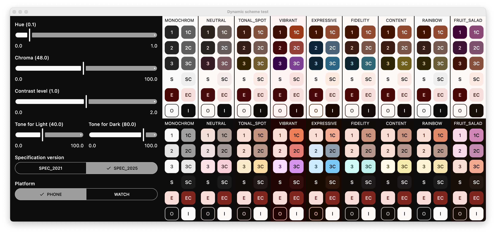

# Dynamic Scheme Test

A simple visualizer for themes generated using the [`material-color-utilities`](https://github.com/material-foundation/material-color-utilities) library, wrapped via [`common-dynamiccolor`](https://github.com/hnau256/common-dynamiccolor) for Gradle/JitPack usage.

## Purpose

This tool helps to visually explore how different input parameters (such as hue, chroma, contrast level, etc.) affect the resulting color schemes. It's useful for understanding how the dynamic color algorithm behaves across versions and platforms.

## Screenshot



## Features

- Supports Material algorithm versions: **2021** and **2025**
- Platform options: **Phone** and **Watch**
- Adjustable input parameters:
    - `Hue`: from 0.0 to 1.0
    - `Chroma`: numeric saturation level
    - `Tone`: base tone value
    - `ContrastLevel`: from 0.0 to 2.0
- Automatically generates previews:
    - For all color scheme variants (Primary, Secondary, Tertiary, Neutral, NeutralVariant, Error, etc.)
    - In both **light** and **dark** modes

## How to Run

```bash
./gradlew :app:run
```

## Dependencies

Uses the [`common-dynamiccolor`](https://github.com/hnau256/common-dynamiccolor) wrapper for integrating the original Java implementation via JitPack.

## Built With

- Kotlin
- Jetpack Compose Multiplatform
